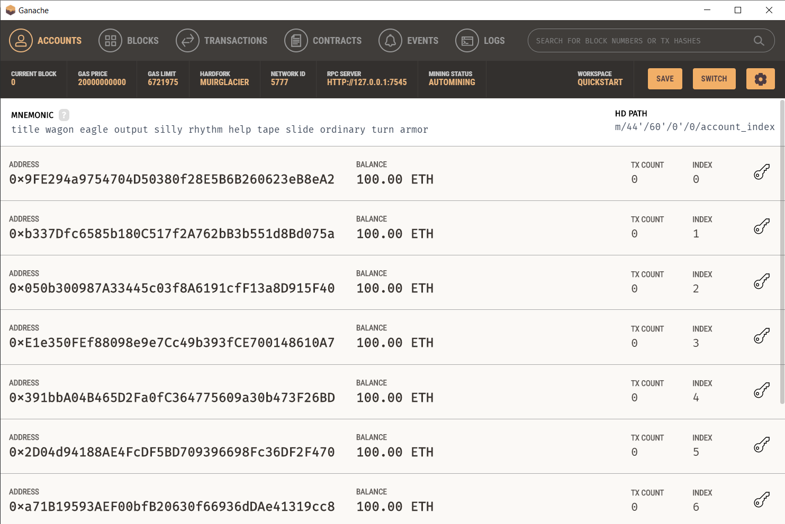

# opzetten-defi-bedrijf-smartcontract

## How to run local

First you need to be able to run a local develop blockchain. Use Ganache from Truffle Suite, available to download [here](https://www.trufflesuite.com/ganache). When you have installed Ganache run the program and click on "Quickstart". The screen that will appear will look like this 

As seen in the image above, the network ID needs to be 5777 and the RPC server http://127.0.0.1:7545. These are the parameters that the TulpSwap protocol expects for local testing. This can be changed if necessary in the truffle-config.js files for the contracts.

Now run "npm install" in the core, migrator and periphery directories to install the necessary dependencies. When that is done you can run "truffle migrate" in the core, migrator and periphery directories to make a migration of the contracts to make sure that they run as intended. 